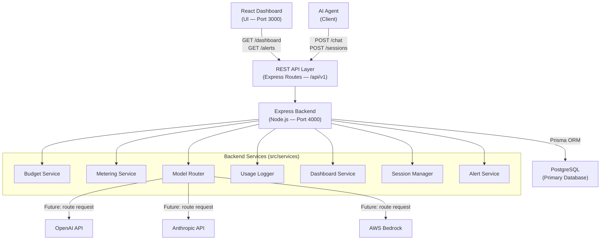
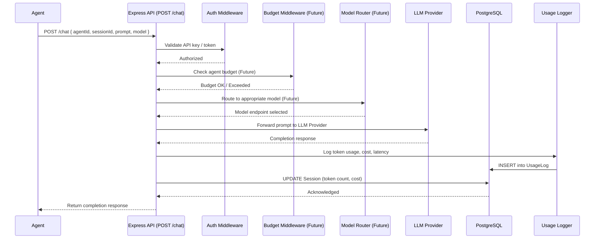
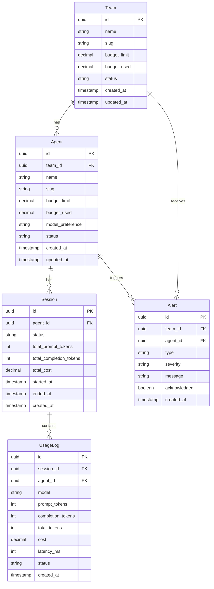

# Agent Budget Controller — Architecture Documentation

## Overview

The Agent Budget Controller is an enterprise-grade AI governance layer that acts as a proxy
between AI Agents and LLM providers (OpenAI, Anthropic, AWS Bedrock, etc.).

Every agent request passes through this system, enabling centralized:
- Budget enforcement
- Token metering
- Cost tracking
- Model substitution
- Session management
- Runaway agent detection
- Alerting and dashboards

---

## 1. High-Level Architecture



---

## 2. Request Flow



### Step-by-Step Explanation

| Step | Description |
|------|-------------|
| 1 | Agent sends `POST /chat` with `agentId`, `sessionId`, prompt, and desired model |
| 2 | Auth middleware validates the request (API key / JWT) |
| 3 | Budget Middleware (future) checks if the agent/team has remaining budget |
| 4 | Model Router (future) selects the appropriate LLM based on budget/config |
| 5 | Request is forwarded to the LLM Provider |
| 6 | Response is returned from the LLM |
| 7 | Usage Logger writes token counts, cost estimate, and latency to the database |
| 8 | Session record is updated with cumulative token/cost data |
| 9 | Response is returned to the calling agent |

---

## 3. Core Module Responsibilities

### Budget Service
Responsible for all budget-related decisions:
- Reading per-team and per-agent budget limits from the database
- Calculating remaining budget in real time
- Blocking or warning when thresholds are crossed
- Triggering the Alert Service when budgets are exhausted

### Metering Service
Responsible for token and cost accounting:
- Counting prompt tokens and completion tokens per request
- Mapping model names to cost-per-token rates
- Calculating USD cost per request
- Aggregating usage by agent, session, team, and time window

### Model Router
Responsible for LLM provider selection:
- Routing requests to the configured primary model
- Substituting a cheaper model when budget is low (future)
- Abstracting provider-specific APIs behind a common interface
- Retrying on provider failures with fallback logic

### Usage Logger
Responsible for persisting request data:
- Writing every request/response record to the `UsageLog` table
- Recording latency, token counts, cost, and model used
- Providing the raw data foundation for dashboards and audits

### Dashboard Service
Responsible for aggregating analytics:
- Summarizing usage by team, agent, day, and model
- Calculating burn rate and projected spend
- Surfacing top consumers and anomalies
- Serving pre-computed stats to the React dashboard

### Session Manager
Responsible for session lifecycle:
- Creating and closing agent sessions
- Tracking per-session token budgets
- Detecting idle or runaway sessions
- Enforcing session-level limits

### Alert Service
Responsible for notifications and warnings:
- Generating alerts when budget thresholds are crossed (50%, 80%, 100%)
- Persisting alerts to the `Alert` table
- Future: dispatching notifications via email, Slack, or webhook

---

## 4. Database Design

### ER Diagram



### Table Definitions

#### `Team`
| Column | Type | Constraints | Description |
|--------|------|-------------|-------------|
| id | UUID | PK, DEFAULT gen_random_uuid() | Unique team identifier |
| name | VARCHAR(255) | NOT NULL | Human-readable team name |
| slug | VARCHAR(100) | NOT NULL, UNIQUE | URL-safe identifier |
| budget_limit | DECIMAL(12,6) | NOT NULL, DEFAULT 0 | Max spend in USD |
| budget_used | DECIMAL(12,6) | NOT NULL, DEFAULT 0 | Cumulative spend in USD |
| status | VARCHAR(20) | NOT NULL, DEFAULT 'active' | active / suspended |
| created_at | TIMESTAMPTZ | NOT NULL, DEFAULT NOW() | Record creation time |
| updated_at | TIMESTAMPTZ | NOT NULL, DEFAULT NOW() | Last update time |

#### `Agent`
| Column | Type | Constraints | Description |
|--------|------|-------------|-------------|
| id | UUID | PK, DEFAULT gen_random_uuid() | Unique agent identifier |
| team_id | UUID | FK → Team.id, NOT NULL | Owning team |
| name | VARCHAR(255) | NOT NULL | Agent display name |
| slug | VARCHAR(100) | NOT NULL | Agent identifier within team |
| budget_limit | DECIMAL(12,6) | NOT NULL, DEFAULT 0 | Max spend for this agent |
| budget_used | DECIMAL(12,6) | NOT NULL, DEFAULT 0 | Agent cumulative spend |
| model_preference | VARCHAR(100) | NULLABLE | Preferred LLM model |
| status | VARCHAR(20) | NOT NULL, DEFAULT 'active' | active / suspended / blocked |
| created_at | TIMESTAMPTZ | NOT NULL, DEFAULT NOW() | |
| updated_at | TIMESTAMPTZ | NOT NULL, DEFAULT NOW() | |

Unique constraint: `(team_id, slug)`

#### `Session`
| Column | Type | Constraints | Description |
|--------|------|-------------|-------------|
| id | UUID | PK, DEFAULT gen_random_uuid() | Unique session identifier |
| agent_id | UUID | FK → Agent.id, NOT NULL | Owning agent |
| status | VARCHAR(20) | NOT NULL, DEFAULT 'active' | active / closed / terminated |
| total_prompt_tokens | INTEGER | NOT NULL, DEFAULT 0 | Cumulative prompt tokens |
| total_completion_tokens | INTEGER | NOT NULL, DEFAULT 0 | Cumulative completion tokens |
| total_cost | DECIMAL(12,6) | NOT NULL, DEFAULT 0 | Session cumulative cost |
| started_at | TIMESTAMPTZ | NOT NULL, DEFAULT NOW() | When session began |
| ended_at | TIMESTAMPTZ | NULLABLE | When session was closed |
| created_at | TIMESTAMPTZ | NOT NULL, DEFAULT NOW() | |

#### `UsageLog`
| Column | Type | Constraints | Description |
|--------|------|-------------|-------------|
| id | UUID | PK, DEFAULT gen_random_uuid() | Log entry identifier |
| session_id | UUID | FK → Session.id, NOT NULL | Associated session |
| agent_id | UUID | FK → Agent.id, NOT NULL | Denormalized for query performance |
| model | VARCHAR(100) | NOT NULL | Model used (e.g. gpt-4o) |
| prompt_tokens | INTEGER | NOT NULL, DEFAULT 0 | Input token count |
| completion_tokens | INTEGER | NOT NULL, DEFAULT 0 | Output token count |
| total_tokens | INTEGER | NOT NULL, DEFAULT 0 | Sum of above |
| cost | DECIMAL(12,6) | NOT NULL, DEFAULT 0 | Estimated USD cost |
| latency_ms | INTEGER | NULLABLE | End-to-end latency |
| status | VARCHAR(20) | NOT NULL, DEFAULT 'success' | success / error / blocked |
| created_at | TIMESTAMPTZ | NOT NULL, DEFAULT NOW() | |

#### `Alert`
| Column | Type | Constraints | Description |
|--------|------|-------------|-------------|
| id | UUID | PK, DEFAULT gen_random_uuid() | Alert identifier |
| team_id | UUID | FK → Team.id, NULLABLE | Affected team (if applicable) |
| agent_id | UUID | FK → Agent.id, NULLABLE | Affected agent (if applicable) |
| type | VARCHAR(50) | NOT NULL | budget_warning / budget_exceeded / runaway_detected |
| severity | VARCHAR(20) | NOT NULL, DEFAULT 'info' | info / warning / critical |
| message | TEXT | NOT NULL | Human-readable description |
| acknowledged | BOOLEAN | NOT NULL, DEFAULT false | Has an operator acknowledged this |
| created_at | TIMESTAMPTZ | NOT NULL, DEFAULT NOW() | |

### Relationships
- **Team → Agent**: One team owns many agents (`1:N`)
- **Agent → Session**: One agent can have many sessions (`1:N`)
- **Session → UsageLog**: One session contains many log entries (`1:N`)
- **Team → Alert**: Alerts can be scoped to a team (`1:N`, nullable FK)
- **Agent → Alert**: Alerts can be scoped to an agent (`1:N`, nullable FK)

---

## 5. API Design

### Base URL
```
http://localhost:4000/api/v1
```

---

### `GET /health`
**Purpose**: Liveness check for load balancers and monitoring systems.

**Response 200**
```json
{
  "status": "healthy",
  "timestamp": "2024-01-15T10:30:00.000Z",
  "uptime": 3600.5,
  "environment": "development"
}
```

---

### `POST /teams`
**Purpose**: Register a new team with a budget limit.

**Request Body**
```json
{
  "name": "Platform Engineering",
  "slug": "platform-eng",
  "budget_limit": 500.00
}
```

**Response 201**
```json
{
  "id": "uuid",
  "name": "Platform Engineering",
  "slug": "platform-eng",
  "budget_limit": 500.00,
  "budget_used": 0,
  "status": "active",
  "created_at": "..."
}
```

**Error Responses**: `400` (validation), `409` (slug conflict)

---

### `GET /teams`
**Purpose**: List all registered teams with pagination.

**Query Params**: `?status=active&page=1&limit=20`

**Response 200**
```json
{
  "data": [ { "...team" : "..." } ],
  "pagination": { "total": 42, "page": 1, "limit": 20 }
}
```

---

### `POST /agents`
**Purpose**: Register a new agent under a team.

**Request Body**
```json
{
  "team_id": "uuid",
  "name": "Data Extraction Agent",
  "slug": "data-extractor",
  "budget_limit": 50.00,
  "model_preference": "gpt-4o"
}
```

**Response 201**
```json
{
  "id": "uuid",
  "team_id": "uuid",
  "name": "Data Extraction Agent",
  "slug": "data-extractor",
  "budget_limit": 50.00,
  "budget_used": 0,
  "model_preference": "gpt-4o",
  "status": "active",
  "created_at": "..."
}
```

**Error Responses**: `400` (validation), `404` (team not found)

---

### `GET /agents`
**Purpose**: List agents, optionally filtered by team.

**Query Params**: `?team_id=uuid&status=active&page=1&limit=20`

**Response 200**
```json
{
  "data": [ { "...agent" : "..." } ],
  "pagination": { "total": 10, "page": 1, "limit": 20 }
}
```

---

### `POST /sessions`
**Purpose**: Open a new session for an agent.

**Request Body**
```json
{
  "agent_id": "uuid"
}
```

**Response 201**
```json
{
  "id": "uuid",
  "agent_id": "uuid",
  "status": "active",
  "total_prompt_tokens": 0,
  "total_completion_tokens": 0,
  "total_cost": 0,
  "started_at": "..."
}
```

**Error Responses**: `400` (validation), `404` (agent not found)

---

### `POST /chat`
**Purpose**: Primary inference endpoint. Future middleware will enforce budgets and route models.

**Request Body**
```json
{
  "session_id": "uuid",
  "agent_id": "uuid",
  "model": "gpt-4o",
  "prompt": "Summarize the following document..."
}
```

**Response 200**
```json
{
  "session_id": "uuid",
  "model": "gpt-4o",
  "response": "...",
  "usage": {
    "prompt_tokens": 120,
    "completion_tokens": 80,
    "total_tokens": 200,
    "cost": 0.003200
  },
  "latency_ms": 842
}
```

**Error Responses**: `400` (validation), `402` (budget exceeded — future), `503` (provider unavailable)

---

### `GET /dashboard`
**Purpose**: Aggregated usage statistics for the React dashboard.

**Query Params**: `?team_id=uuid&from=2024-01-01&to=2024-01-31`

**Response 200**
```json
{
  "total_cost": 1234.56,
  "total_tokens": 4500000,
  "total_requests": 12800,
  "top_agents": [ { "agent_id": "...", "cost": 400.00 } ],
  "daily_breakdown": [ { "date": "2024-01-15", "cost": 45.20 } ]
}
```

---

### `GET /alerts`
**Purpose**: Retrieve system alerts for a team or agent.

**Query Params**: `?team_id=uuid&acknowledged=false&page=1&limit=20`

**Response 200**
```json
{
  "data": [
    {
      "id": "uuid",
      "type": "budget_warning",
      "severity": "warning",
      "message": "Agent 'data-extractor' has used 80% of its budget.",
      "acknowledged": false,
      "created_at": "..."
    }
  ],
  "pagination": { "total": 3, "page": 1, "limit": 20 }
}
```

---

## 6. Folder Structure

```
backend/
├── src/
│   ├── config/               # Centralized configuration
│   │   ├── db.js             # Prisma client singleton
│   │   ├── env.js            # Validated env vars (dotenv + Zod)
│   │   └── logger.js         # Pino logger instance
│   │
│   ├── controllers/          # Thin HTTP layer — parse req, call service, send res
│   │   ├── health.controller.js
│   │   ├── team.controller.js
│   │   ├── agent.controller.js
│   │   ├── session.controller.js
│   │   ├── chat.controller.js
│   │   ├── dashboard.controller.js
│   │   └── alert.controller.js
│   │
│   ├── services/             # Business logic — all domain rules live here
│   │   ├── team.service.js
│   │   ├── agent.service.js
│   │   ├── session.service.js
│   │   ├── chat.service.js
│   │   ├── budget.service.js       # (future — Milestone 3)
│   │   ├── metering.service.js     # (future — Milestone 3)
│   │   ├── modelRouter.service.js  # (future — Milestone 4)
│   │   ├── usageLogger.service.js  # (future — Milestone 3)
│   │   ├── dashboard.service.js    # (future — Milestone 5)
│   │   └── alert.service.js        # (future — Milestone 3)
│   │
│   ├── repositories/         # Database access layer — all Prisma queries
│   │   ├── team.repository.js
│   │   ├── agent.repository.js
│   │   ├── session.repository.js
│   │   ├── usageLog.repository.js
│   │   └── alert.repository.js
│   │
│   ├── routes/               # Express route definitions
│   │   ├── index.js          # Root router — mounts all sub-routers
│   │   ├── health.routes.js
│   │   ├── team.routes.js
│   │   ├── agent.routes.js
│   │   ├── session.routes.js
│   │   ├── chat.routes.js
│   │   ├── dashboard.routes.js
│   │   └── alert.routes.js
│   │
│   ├── middleware/           # Express middleware — cross-cutting concerns
│   │   ├── errorHandler.js   # Centralized error responder
│   │   ├── notFound.js       # 404 handler
│   │   ├── requestLogger.js  # Pino HTTP request logging
│   │   └── validate.js       # Zod request validation wrapper
│   │
│   ├── validations/          # Zod schemas — one file per resource
│   │   ├── team.validation.js
│   │   ├── agent.validation.js
│   │   ├── session.validation.js
│   │   └── chat.validation.js
│   │
│   ├── utils/                # Pure utility functions
│   │   ├── AppError.js       # Custom error class
│   │   ├── asyncHandler.js   # Wraps async controllers to catch errors
│   │   └── pagination.js     # Shared pagination helper
│   │
│   ├── prisma/
│   │   └── schema.prisma     # Database schema + migrations
│   │
│   ├── app.js                # Express app factory (no listen)
│   └── server.js             # HTTP server bootstrap (calls listen)
│
├── .env                      # Local secrets (gitignored)
├── .env.example              # Safe template committed to repo
├── .gitignore
├── docker-compose.yml
├── Dockerfile
├── package.json
└── README.md
```

### Folder Responsibility Summary

| Folder | Responsibility |
|--------|----------------|
| `config/` | Single source of truth for env vars, DB client, and logger |
| `controllers/` | HTTP layer only: read `req`, call a service, send `res`. No DB, no business logic |
| `services/` | All domain rules and orchestration. Services call repositories, never touch `req`/`res` |
| `repositories/` | All Prisma/SQL queries. Services call repositories; controllers never query the DB directly |
| `routes/` | Map HTTP verbs + paths to controllers. Apply route-level middleware |
| `middleware/` | Reusable Express middleware: error handling, 404, logging, validation |
| `validations/` | Zod schemas describing the shape and rules for each request body/query |
| `utils/` | Stateless helper functions used across layers |
| `prisma/` | Database schema and Prisma migration files |
